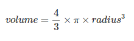

จงเขียนโปรแกรมเพื่อคำนวณค่าปริมาตร (volume) ของทรงกลม ในรูปแบบทศนิยม 2 ตำแหน่ง โดยค่ารัศมี (ตัวแปร radius) เป็นจำนวนจริง

โดยใช้การคำนวณจากสูตร  
  

กำหนดค่าคงที่ π = 22 / 7  

**ตัวอย่างผลลัพธ์ เมื่อตัวแปร radius มีค่า 1.5**

```
The volume of this sphere is 14.14
```

## CODE
```c
#include <stdio.h>
#include <stdlib.h>

// กำหนดค่าคงที่ PI มีค่า 22.0/7
#define PI 22.0/7

int main()
{
    float radius = 1.5;
    
    float volume = (4.0 / 3) * PI * pow(radius, 3);
    printf("The volume of this sphere is %.2f", volume);

    return 0;
}
```
